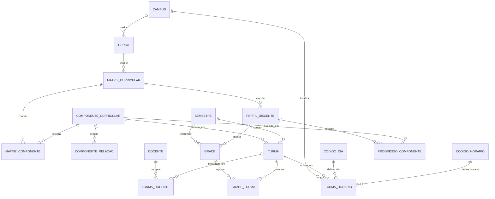

# Documento de Modelo de Dados — GradeAção

**Projeto:** GradeAção — Planejador de Grade Horária para Discentes da UnB
**Versão:** 1.0
**Data:** 13 de agosto de 2026
**SGBD:** PostgreSQL (Supabase)
**ORM:** Django
**Documento relacionado:** Documento de Requisitos de Software — GradeAção v1.0

---

## Sumário

1. [Visão Geral](#1-visão-geral)
2. [Diagrama Entidade-Relacionamento](#2-diagrama-entidade-relacionamento)
3. [Dicionário de Dados](#3-dicionário-de-dados)
4. [Entidades Complementares](#4-entidades-complementares)
5. [Regras de Integridade](#5-regras-de-integridade)
6. [Dados de Carga Inicial](#6-dados-de-carga-inicial)
7. [DDL PostgreSQL](#7-ddl-postgresql)
8. [Modelos Django](#8-modelos-django)
9. [Consultas Fundamentais](#9-consultas-fundamentais)
10. [Índices e Desempenho](#10-índices-e-desempenho)
11. [Decisões de Modelagem e Pontos de Atenção](#11-decisões-de-modelagem-e-pontos-de-atenção)
12. [Histórico de Revisões](#12-histórico-de-revisões)

---

## 1. Visão Geral

O modelo de dados do GradeAção organiza-se em quatro domínios:

| Domínio | Entidades | Origem dos dados |
|---|---|---|
| **Estrutura acadêmica** | `campus`, `curso`, `matriz_curricular`, `componente_curricular`, `componente_relacao` | Dados públicos, carga por curador |
| **Oferta** | `semestre`, `docente`, `turma`, `turma_horario`,`turma_docente`, `codigo_dia`, `codigo_horario` | Dados públicos, carga por semestre |
| **Planejamento** | `grade`, `grade_turma` | Gerados pelo próprio discente |
| **Perfil e progresso** | `perfil_discente`, `progresso_componente` | Declarados pelo discente |

Convenções adotadas:

- Nomes de tabelas e colunas em **snake_case**, no singular.
- Chave primária substituta `id` em todas as tabelas.
- Campos de auditoria `criado_em` e `atualizado_em` nas tabelas de escrita frequente.
- Exclusão lógica não é utilizada; a exclusão de conta remove fisicamente os dados do discente (RN13).
- Textos livres em `TEXT`; identificadores curtos em `VARCHAR` com limite explícito.

---

## 2. Diagrama Entidade-Relacionamento



### 2.1 Visão textual das cardinalidades

```
campus 1 ──── N curso
curso 1 ──── N matriz_curricular
matriz_curricular N ──── N componente_curricular      (via matriz_componente)
componente_curricular N ──── N componente_curricular  (via componente_relacao, tipificada)

semestre 1 ──── N turma
componente_curricular 1 ──── N turma
docente N ──── N turma
turma 1 ──── N turma_horario
codigo_dia 1 ──── N turma_horario
codigo_horario 1 ──── N turma_horario
campus 1 ──── N turma_horario

perfil_discente 1 ──── N grade
semestre 1 ──── N grade
grade N ──── N turma              (via grade_turma)

perfil_discente 1 ──── N progresso_componente
componente_curricular 1 ──── N progresso_componente
```

---

## 3. Dicionário de Dados

### 3.1 `campus`

Unidade física em que ocorrem as aulas.

| Coluna | Tipo | Restrições | Descrição |
|---|---|---|---|
| `id` | BIGSERIAL | PK | Identificador |
| `codigo` | VARCHAR(10) | NOT NULL, UNIQUE | Sigla do campus (ex.: `FCTE`) |
| `nome` | VARCHAR(120) | NOT NULL | Denominação do campus |
| `criado_em` | TIMESTAMPTZ | NOT NULL, DEFAULT now() | — |

---

### 3.2 `curso`

Programa de formação ao qual o discente se vincula.

| Coluna | Tipo | Restrições | Descrição |
|---|---|---|---|
| `id` | BIGSERIAL | PK | Identificador |
| `nome` | VARCHAR(160) | NOT NULL | Denominação do curso |
| `codigo` | VARCHAR(20) | NULL, UNIQUE | Código público do curso, quando divulgado |
| `campus_id` | BIGINT | FK → `campus.id`, NULL | Campus de oferta predominante |
| `turno` | VARCHAR(20) | NULL | Diurno, noturno ou integral |
| `criado_em` | TIMESTAMPTZ | NOT NULL, DEFAULT now() | — |

---

### 3.3 `matriz_curricular`

Conjunto de componentes exigidos para a integralização de um curso. Um curso pode possuir várias matrizes ao longo do tempo.

| Coluna | Tipo | Restrições | Descrição |
|---|---|---|---|
| `id` | BIGSERIAL | PK | Identificador |
| `curso_id` | BIGINT | FK → `curso.id`, NOT NULL | Curso ao qual pertence |
| `nome` | VARCHAR(160) | NOT NULL | Denominação da matriz (ex.: `Currículo 2021/1`) |
| `codigo` | VARCHAR(20) | NULL | Código público da matriz |
| `vigencia_inicio` | VARCHAR(6) | NULL | Semestre inicial de vigência (`AAAAP`) |
| `vigencia_fim` | VARCHAR(6) | NULL | Semestre final; nulo quando vigente |
| `carga_horaria_minima_periodo_letivo` | SMALLINT | NULL, CHECK ≥ 0 | Carga horária mínima por período letivo         |
| `carga_horaria_maxima_periodo_letivo` | SMALLINT | NULL, CHECK ≥ 0 | Carga horária máxima por período letivo         |
| `criado_em` | TIMESTAMPTZ | NOT NULL, DEFAULT now() | — |

**Unicidade:** (`curso_id`, `nome`)

---

### 3.4 `componente_curricular`

Unidade de ensino com código e créditos próprios.

| Coluna | Tipo | Restrições | Descrição |
|---|---|---|---|
| `id` | BIGSERIAL | PK | Identificador |
| `codigo` | VARCHAR(15) | NOT NULL, UNIQUE | Código público do componente |
| `nome` | VARCHAR(200) | NOT NULL | Denominação |
| `carga_horaria` | SMALLINT | NULL, CHECK ≥ 0 | Carga horária total em horas |
| `departamento` | VARCHAR(120) | NULL | Unidade responsável pela oferta |
| `ementa` | TEXT | NULL | Ementa pública resumida |
| `ativo` | BOOLEAN | NOT NULL, DEFAULT TRUE | Indica se ainda é ofertado |
| `criado_em` | TIMESTAMPTZ | NOT NULL, DEFAULT now() | — |
| `atualizado_em` | TIMESTAMPTZ | NOT NULL, DEFAULT now() | — |

---

### 3.5 `componente_relacao`

Relação dirigida entre dois componentes curriculares, tipificada.

| Coluna | Tipo | Restrições | Descrição |
|---|---|---|---|
| `id` | BIGSERIAL | PK | Identificador |
| `componente_id` | BIGINT | FK → `componente_curricular.id`, NOT NULL | Componente de origem |
| `componente_relacionado_id` | BIGINT | FK → `componente_curricular.id`, NOT NULL | Componente de destino |
| `tipo` | VARCHAR(15) | NOT NULL, CHECK IN (`PRE_REQUISITO`, `CO_REQUISITO`, `EQUIVALENCIA`) | Natureza da relação |
| `bidirecional` | BOOLEAN | NOT NULL, DEFAULT FALSE | Aplicável a equivalências (RN06) |
| `observacao` | TEXT | NULL | Anotação do curador |

**Unicidade:** (`componente_id`, `componente_relacionado_id`, `tipo`)
**Restrição:** `componente_id <> componente_relacionado_id`

**Semântica de leitura:**

| `tipo` | Interpretação |
|---|---|
| `PRE_REQUISITO` | Para cursar `componente_id`, é necessário ter cursado `componente_relacionado_id` |
| `CO_REQUISITO` | Para cursar `componente_id`, é necessário cursar `componente_relacionado_id` no mesmo semestre ou antes |
| `EQUIVALENCIA` | Cursar `componente_relacionado_id` satisfaz a exigência de `componente_id` |

**Semântica do campo `grupo`:** relações de mesmo `componente_id`, mesmo `tipo` e mesmo `grupo` combinam-se por **OU**; grupos distintos combinam-se por **E**.

```
Exemplo — o componente ALG2 exige (CALC1 OU CALC1-EAD) E LP1:

componente_id | relacionado | tipo          | grupo
--------------|-------------|---------------|------
ALG2          | CALC1       | PRE_REQUISITO |   1
ALG2          | CALC1-EAD   | PRE_REQUISITO |   1
ALG2          | LP1         | PRE_REQUISITO |   2
```

---

### 3.6 `semestre`

Período letivo ao qual se vinculam a oferta e as grades.

| Coluna | Tipo | Restrições | Descrição |
|---|---|---|---|
| `id` | BIGSERIAL | PK | Identificador |
| `codigo` | VARCHAR(6) | NOT NULL, UNIQUE | Identificação no formato `AAAAP` (ex.: `20262`) |
| `ano` | SMALLINT | NOT NULL, CHECK ≥ 2000 | Ano civil |
| `periodo` | SMALLINT | NOT NULL, CHECK IN (0, 1, 2) | 1, 2 ou 0 para verão |
| `data_inicio` | DATE | NULL | Início das aulas |
| `data_fim` | DATE | NULL | Encerramento das aulas |
| `ativo` | BOOLEAN | NOT NULL, DEFAULT FALSE | Semestre exibido por padrão no planejador |
| `oferta_atualizada_em` | TIMESTAMPTZ | NULL | Data da última carga de oferta (RF12, RF45) |

**Unicidade:** (`ano`, `periodo`)

---

### 3.7 `docente`

Professor responsável por turmas. Registro alimentado apenas com informação publicamente divulgada na oferta.

| Coluna | Tipo | Restrições | Descrição |
|---|---|---|---|
| `id` | BIGSERIAL | PK | Identificador |
| `nome` | VARCHAR(200) | NOT NULL, UNIQUE | Nome do docente conforme divulgado |
| `criado_em` | TIMESTAMPTZ | NOT NULL, DEFAULT now() | — |

---

### 3.8 `turma`

Instância concreta de um componente curricular em um semestre.

| Coluna | Tipo | Restrições | Descrição |
|---|---|---|---|
| `id` | BIGSERIAL | PK | Identificador |
| `semestre_id` | BIGINT | FK → `semestre.id`, NOT NULL | Semestre da oferta |
| `componente_id` | BIGINT | FK → `componente_curricular.id`, NOT NULL | Componente ofertado |
| `codigo` | VARCHAR(10) | NOT NULL | Identificação da turma (ex.: `A`, `01`, `TA`) |
| `vagas_ofertadas` | SMALLINT | NULL, CHECK ≥ 0 | Vagas divulgadas na coleta |
| `vagas_ocupadas` | SMALLINT | NULL, CHECK ≥ 0 | Ocupação na data da coleta |
| `modalidade` | VARCHAR(20) | NULL | Presencial, remota ou híbrida |
| `observacao` | TEXT | NULL | Reservas de vagas e demais notas públicas |
| `coletado_em` | TIMESTAMPTZ | NULL | Data da coleta dos dados desta turma |

**Unicidade:** (`semestre_id`, `componente_id`, `codigo`)

> Os campos de vagas são **informativos e datados** (RN10). O sistema não os consulta em tempo real.

---

### 3.9 `turma_docente`

Docente(s) vinculado(s) a uma turma.

| Coluna          | Tipo        | Restrições                                   | Descrição                             |
| --------------- | ----------- | -------------------------------------------- | ------------------------------------- |
| `id`            | BIGSERIAL   | PK                                           | Identificador                         |
| `turma_id`      | BIGINT      | FK → `turma.id`, NOT NULL, ON DELETE CASCADE | Turma                                 |
| `docente_id`    | BIGINT      | FK → `docente.id`, NULL                      | Docente responsável, quando divulgado |
| `adicionado_em` | TIMESTAMPTZ | NOT NULL, DEFAULT now()                      | —                                     |

**Unicidade:** (`turma_id`, `docente_id`)

> Os campos de vagas são **informativos e datados** (RN10). O sistema não os consulta em tempo real.

---

### 3.10 `codigo_dia`

Tabela de domínio dos dias da semana.

| Coluna | Tipo | Restrições | Descrição |
|---|---|---|---|
| `id` | BIGSERIAL | PK | Identificador |
| `codigo` | VARCHAR(2) | NOT NULL, UNIQUE | Código público do dia |
| `dia_da_semana` | VARCHAR(20) | NOT NULL | Denominação por extenso |
| `ordem` | SMALLINT | NOT NULL, UNIQUE | Posição de exibição no calendário |

---

### 3.11 `codigo_horario`

Tabela de domínio dos blocos de horário.

| Coluna | Tipo | Restrições | Descrição |
|---|---|---|---|
| `id` | BIGSERIAL | PK | Identificador |
| `codigo` | VARCHAR(4) | NOT NULL, UNIQUE | Código público do bloco (ex.: `M1`) |
| `horario` | VARCHAR(20) | NOT NULL | Representação textual (ex.: `08:00–08:55`) |
| `hora_inicio` | TIME | NOT NULL | Início do bloco |
| `hora_fim` | TIME | NOT NULL | Término do bloco |
| `turno` | CHAR(1) | NOT NULL, CHECK IN (`M`, `T`, `N`) | Turno |
| `ordem` | SMALLINT | NOT NULL, UNIQUE | Posição de exibição no calendário |

**Restrição:** `hora_inicio < hora_fim`

> As colunas `hora_inicio` e `hora_fim` foram acrescentadas ao esboço original porque a detecção de choque de horário (RN01) exige comparação de intervalos. Comparar apenas o `codigo` textual não permite identificar sobreposições parciais nem tratar blocos fora do padrão.

---

### 3.12 `turma_horario`

Encontro semanal de uma turma: onde e quando ocorre. Uma turma possui um ou mais registros.

| Coluna | Tipo | Restrições | Descrição |
|---|---|---|---|
| `id` | BIGSERIAL | PK | Identificador |
| `turma_id` | BIGINT | FK → `turma.id`, NOT NULL, ON DELETE CASCADE | Turma |
| `campus_id` | BIGINT | FK → `campus.id`, NULL | Campus do encontro |
| `codigo_dia_id` | BIGINT | FK → `codigo_dia.id`, NOT NULL | Dia da semana |
| `codigo_horario_id` | BIGINT | FK → `codigo_horario.id`, NOT NULL | Bloco de horário |
| `local` | VARCHAR(40) | NULL | Local de encontro |

**Unicidade:** (`turma_id`, `codigo_dia_id`, `codigo_horario_id`)

> O campus reside aqui, e não em `turma`, porque uma mesma turma pode ter encontros em locais distintos. Essa escolha também permite alertar o discente sobre deslocamentos entre blocos consecutivos.

---

### 3.13 `grade`

Cenário de grade horária montado por um discente para um semestre.

| Coluna | Tipo | Restrições | Descrição |
|---|---|---|---|
| `id` | BIGSERIAL | PK | Identificador |
| `usuario_id` | BIGINT | FK → `auth_user.id`, NOT NULL, ON DELETE CASCADE | Titular da grade |
| `semestre_id` | BIGINT | FK → `semestre.id`, NOT NULL | Semestre de referência |
| `nome` | VARCHAR(80) | NOT NULL | Nome do cenário (ex.: `Plano A — manhã`) |
| `valida` | BOOLEAN | NOT NULL, DEFAULT TRUE | `FALSE` para rascunho com choque (RN02) |
| `token_publico` | UUID | NULL, UNIQUE | Token do link somente-leitura (RF40) |
| `criado_em` | TIMESTAMPTZ | NOT NULL, DEFAULT now() | — |
| `atualizado_em` | TIMESTAMPTZ | NOT NULL, DEFAULT now() | — |

**Unicidade:** (`usuario_id`, `semestre_id`, `nome`)

---

### 3.14 `grade_turma`

Associação entre uma grade e as turmas que a compõem.

| Coluna | Tipo | Restrições | Descrição |
|---|---|---|---|
| `id` | BIGSERIAL | PK | Identificador |
| `grade_id` | BIGINT | FK → `grade.id`, NOT NULL, ON DELETE CASCADE | Grade |
| `turma_id` | BIGINT | FK → `turma.id`, NOT NULL, ON DELETE CASCADE | Turma incluída |
| `prioridade` | VARCHAR(12) | NOT NULL, DEFAULT `PRINCIPAL`, CHECK IN (`PRINCIPAL`, `ALTERNATIVA`) | Classificação da turma no cenário (RF29) |
| `adicionado_em` | TIMESTAMPTZ | NOT NULL, DEFAULT now() | — |

**Unicidade:** (`grade_id`, `turma_id`)
**Regra de aplicação:** `turma.semestre_id` deve ser igual a `grade.semestre_id` (RN09)

---

## 4. Entidades Complementares

As tabelas a seguir são exigidas por requisitos já especificados. Estão isoladas nesta seção para que a equipe decida sobre sua inclusão no escopo da primeira entrega.

### 4.1 `matriz_componente` — *necessária para RF11, RF18*

Associa componentes a uma matriz curricular, com período recomendado e natureza.

| Coluna | Tipo | Restrições | Descrição |
|---|---|---|---|
| `id` | BIGSERIAL | PK | Identificador |
| `matriz_id` | BIGINT | FK → `matriz_curricular.id`, NOT NULL, ON DELETE CASCADE | Matriz |
| `componente_id` | BIGINT | FK → `componente_curricular.id`, NOT NULL | Componente |
| `periodo_recomendado` | SMALLINT | NULL, CHECK BETWEEN 1 AND 20 | Período sugerido na matriz |
| `natureza` | VARCHAR(15) | NOT NULL, CHECK IN (`OBRIGATORIO`, `OPTATIVO`, `MODULO_LIVRE`) | Natureza do componente na matriz |

**Unicidade:** (`matriz_id`, `componente_id`)

> Sem esta tabela, a matriz curricular é apenas um rótulo, e os requisitos de exibição da matriz e de cálculo de progresso não podem ser atendidos.

### 4.2 `perfil_discente` — *necessária para RF04, RF11, RF18*

| Coluna | Tipo | Restrições | Descrição |
|---|---|---|---|
| `id` | BIGSERIAL | PK | Identificador |
| `usuario_id` | BIGINT | FK → `auth_user.id`, NOT NULL, UNIQUE, ON DELETE CASCADE | Usuário |
| `matriz_id` | BIGINT | FK → `matriz_curricular.id`, NULL | Matriz declarada |
| `criado_em` | TIMESTAMPTZ | NOT NULL, DEFAULT now() | — |

### 4.3 `progresso_componente` — *necessária para RF16, RF17, RF19, RN03*

| Coluna | Tipo | Restrições | Descrição |
|---|---|---|---|
| `id` | BIGSERIAL | PK | Identificador |
| `usuario_id` | BIGINT | FK → `auth_user.id`, NOT NULL, ON DELETE CASCADE | Usuário |
| `componente_id` | BIGINT | FK → `componente_curricular.id`, NOT NULL | Componente |
| `status` | VARCHAR(12) | NOT NULL, CHECK IN (`CURSADO`, `EM_CURSO`, `PENDENTE`) | Situação declarada |
| `por_equivalencia` | BOOLEAN | NOT NULL, DEFAULT FALSE | Cumprimento por equivalência (RF19) |
| `atualizado_em` | TIMESTAMPTZ | NOT NULL, DEFAULT now() | — |

**Unicidade:** (`usuario_id`, `componente_id`)

> Este registro é **declaratório** (RN12): não há verificação contra fonte oficial.

---

## 5. Regras de Integridade

### 5.1 Garantidas pelo banco de dados

| ID | Regra | Mecanismo |
|---|---|---|
| **I01** | Uma turma não repete o mesmo bloco de horário no mesmo dia | `UNIQUE (turma_id, codigo_dia_id, codigo_horario_id)` |
| **I02** | Um componente não se relaciona consigo mesmo | `CHECK (componente_id <> componente_relacionado_id)` |
| **I03** | Uma turma não se repete dentro de uma grade | `UNIQUE (grade_id, turma_id)` |
| **I04** | O código do componente é único no catálogo | `UNIQUE (codigo)` |
| **I05** | Um semestre não se duplica por ano e período | `UNIQUE (ano, periodo)` |
| **I06** | Turmas de um mesmo componente e semestre têm códigos distintos | `UNIQUE (semestre_id, componente_id, codigo)` |
| **I07** | O bloco de horário tem início anterior ao término | `CHECK (hora_inicio < hora_fim)` |
| **I08** | Uma única grade preferida por usuário e semestre | Índice único parcial `WHERE preferida` |
| **I09** | Excluir uma turma remove seus horários e vínculos de grade | `ON DELETE CASCADE` |
| **I10** | Excluir um usuário remove perfil, progresso e grades (RN13) | `ON DELETE CASCADE` |
| **I11** | Carga horária e vagas não assumem valores negativos | `CHECK (... >= 0)` |

### 5.2 Garantidas pela aplicação

| ID | Regra | Justificativa |
|---|---|---|
| **A01** | Toda turma de uma grade pertence ao mesmo semestre da grade (RN09) | Exigiria coluna redundante ou *trigger*; validado na camada de serviço |
| **A02** | Grade com choque de horário não pode ter `valida = TRUE` (RN02) | Depende de cálculo de interseção de intervalos |
| **A03** | Equivalência com `bidirecional = TRUE` gera o par inverso na leitura | Evita duplicação de linhas no cadastro |
| **A04** | Componente `EM_CURSO` não satisfaz pré-requisito no mesmo semestre (RN05) | Regra temporal, avaliada no módulo de validação |
| **A05** | Pendência de pré-requisito e co-requisito gera alerta, nunca bloqueio (RN08) | Decisão de produto |
| **A06** | Somente curador e administrador alteram catálogo e oferta (RN14) | Controle por permissão do Django |

> As regras da seção 5.2 devem residir no módulo de validação acadêmica, desacoplado das camadas de apresentação e persistência (RNF22).

---

## 6. Dados de Carga Inicial

As tabelas de domínio abaixo devem ser populadas por *migration* de dados. Os valores são **exemplos de partida** e precisam ser conferidos contra a oferta pública antes da carga definitiva.

### 6.1 `codigo_dia`

| `codigo` | `dia_da_semana` | `ordem` |
|---|---|---|
| `2` | Segunda-feira | 1 |
| `3` | Terça-feira | 2 |
| `4` | Quarta-feira | 3 |
| `5` | Quinta-feira | 4 |
| `6` | Sexta-feira | 5 |
| `7` | Sábado | 6 |

### 6.2 `codigo_horario`

| `codigo` | `horario` | `hora_inicio` | `hora_fim` | `turno` | `ordem` |
|---|---|---|---|---|---|
| `M1` | 08:00–08:55 | 08:00 | 08:55 | M | 1 |
| `M2` | 09:00–09:55 | 09:00 | 09:55 | M | 2 |
| `M3` | 10:00–10:55 | 10:00 | 10:55 | M | 3 |
| `M4` | 11:00–11:55 | 11:00 | 11:55 | M | 4 |
| `M5` | 12:00–12:55 | 12:00 | 12:55 | M | 5 |
| `T1` | 14:00–14:55 | 14:00 | 14:55 | T | 6 |
| `T2` | 15:00–15:55 | 15:00 | 15:55 | T | 7 |
| `T3` | 16:00–16:55 | 16:00 | 16:55 | T | 8 |
| `T4` | 17:00–17:55 | 17:00 | 17:55 | T | 9 |
| `T5` | 18:00–18:55 | 18:00 | 18:55 | T | 10 |
| `N1` | 19:00–19:55 | 19:00 | 19:55 | N | 11 |
| `N2` | 20:00–20:55 | 20:00 | 20:55 | N | 12 |
| `N3` | 21:00–21:55 | 21:00 | 21:55 | N | 13 |
| `N4` | 22:00–22:55 | 22:00 | 22:55 | N | 14 |

> **Atenção:** a tabela acima é uma hipótese de trabalho. Os horários efetivos devem ser extraídos da oferta pública durante a primeira carga de dados, e a *migration* ajustada conforme o resultado.

### 6.3 `campus`

| `codigo` | `nome` |
|---|---|
| `DAR` | Campus Darcy Ribeiro |
| `FCTE` | Campus Gama |
| `FCE` | Campus Ceilândia |
| `FUP` | Campus Planaltina |

---

## 7. Decisões de Modelagem e Pontos de Atenção

### 7.1 Limitações conhecidas

| # | Limitação | Encaminhamento |
|---|---|---|
| 1 | A igualdade entre `turma.semestre` e `grade.semestre` não é garantida pelo banco | Validada na aplicação (A01). Alternativa futura: chave estrangeira composta |
| 2 | Blocos de horário fora do padrão institucional não constam da tabela de domínio | Mitigado por `hora_inicio` e `hora_fim`, que permitem cadastrar blocos irregulares |
| 3 | O histórico de alterações da oferta não é preservado; cada carga sobrescreve os dados do semestre | Fora do escopo da v1.0. `coletado_em` registra a data da coleta vigente |
| 4 | Não há versionamento de matriz por discente além do vínculo declarado no perfil | Suficiente para o escopo atual |

### 7.2 Conformidade com privacidade

- As únicas informações pessoais armazenadas são as de conta e as declarações voluntárias de perfil e progresso, em observância ao princípio da necessidade (RNF16).
- Nenhuma tabela armazena credenciais institucionais, número de matrícula, índice de rendimento acadêmico ou qualquer dado obtido de sistema oficial (RNF17).
- Os `ON DELETE CASCADE` a partir de `auth_user` garantem a remoção integral dos dados do discente na exclusão da conta (RN13).
- Os dados de `docente` limitam-se ao nome divulgado publicamente na oferta.

---

## 8. Histórico de Revisões

| Versão | Data | Descrição | Responsável |
|---|---|---|---|
| 1.0 | 13/08/2026 | Versão inicial do modelo de dados | Equipe GradeAção |

---

*Documento elaborado para o projeto acadêmico GradeAção. Iniciativa discente independente, sem vínculo institucional com a Universidade de Brasília.*
